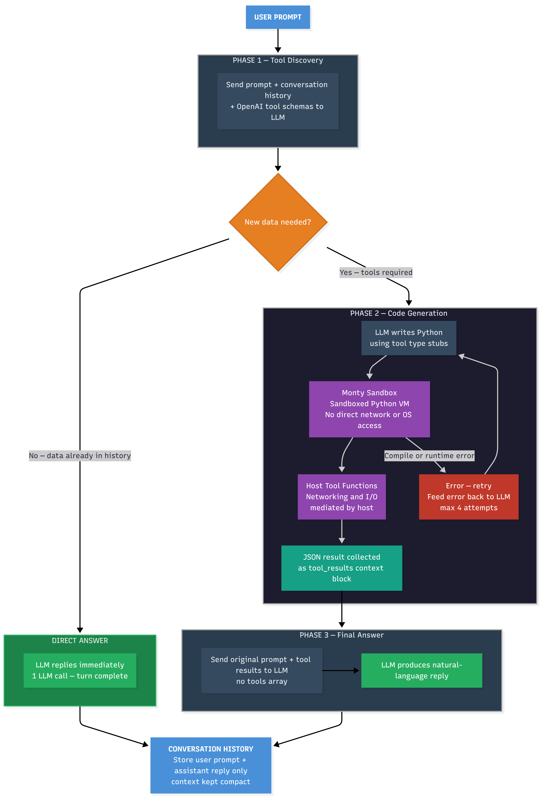
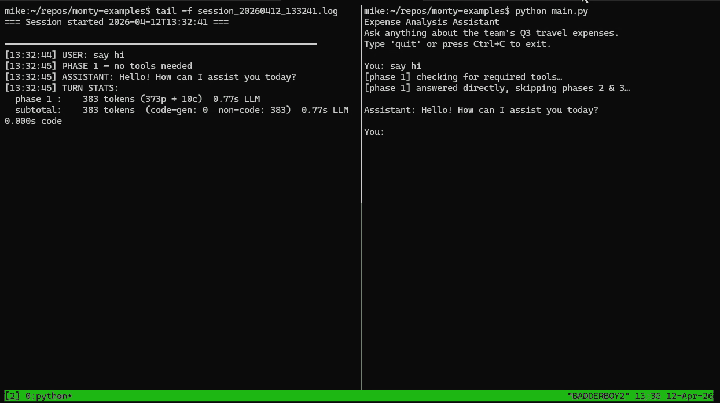

# Callables — LLM + Monty Tool Calling

Demonstrates a conversation pattern for safely executing LLM-generated
Python code that calls host-side tool functions via [Monty](https://github.com/pydantic/monty). Monty is a Rust-based sandboxed Python runtime that compiles a subset of Python source into an internal bytecode format and interprets it in its own VM. When embedded, it runs in-process on the calling thread.

## How it works

```
User prompt
    │
    ▼
Phase 1 — Tool discovery (and direct answer when no tools needed)
    Send prompt + conversation history + OpenAI tool schemas to the model.
    If the required data is already in the conversation history, the model
    answers directly — no further LLM calls are made for this turn.
    If new data is needed, the model signals which tools are relevant.
    │
    ├─ no tools needed → answer returned, turn complete (1 LLM call)
    │
    ▼ only if new data is needed
Phase 2 — Code generation + Monty execution
    Ask the model to write Python code using the full set of tool type stubs.
    The prompt includes the Phase 1 tool calls with their already-resolved
    arguments (e.g. a member name looked up from conversation history becomes
    a concrete user_id), so the model can use those values directly rather
    than issuing redundant lookups. The model still has access to all tool
    stubs and can call additional functions if needed.

    Execute code in the Monty sandbox → calls back to real host functions.
    If the generated code fails to compile or run, the error is fed back
    to the model and it retries (up to 4 attempts).
    Collect the JSON result as a <tool_results> context block.
    │
    ▼
Phase 3 — Final answer
    Send original prompt + tool results to model (no tools array).
    Model produces a data-grounded natural-language reply.

Conversation history retains only the (possibly augmented) user
prompt and the assistant reply — keeping context compact.
```

## Flowchart




## Why this approach instead of direct tool calling?

Standard OpenAI tool calling executes one tool call at a time, round-tripping to the model after each result. The Monty approach lets the model write arbitrarily complex orchestration logic — loops, parallel asyncio.gather calls, aggregations — that runs entirely in the sandbox. The host executes and mediates any intermediate external calls, but the model only needs to see the final computed result. This makes it practical for questions that require fetching data for every team member in parallel and then doing analysis over the combined results using an LLM model.

The Monty VM does not have direct access to networking or OS I/O, although I/O can be handled via an OS-mediated callback similar to a “mount”. Monty can call a set of external functions it is given access to, and those functions can do networking and I/O calls.

The resulting tool executions are often faster because the LLM doesn’t have to round-trip on every intermediate step: the orchestration logic is in Monty code, and the host can run the dispatch loop without involving the model.

## Demo session

Click the preview to open the full MP4:

[](images/output.mp4)

## Session logging

Every run writes a timestamped `session_YYYYMMDD_HHMMSS.log` file recording:

- Each user prompt
- Phase 1 tool-discovery outcome
- Phase 2 generated code (every attempt), errors, and the JSON execution result
- Phase 3 final assistant reply
- Per-turn token accounting split into **code-gen** (Phase 2 LLM calls) vs
  **non-code** (Phase 1 + Phase 3) along with LLM and code execution times
- Session-level grand totals

Turns answered directly from Phase 1 show only a `phase 1` line in TURN STATS:

```
[12:39:01] TURN STATS:
  phase 1 :  6,812 tokens (6671p + 141c)  2.91s LLM
  subtotal:  6,812 tokens  (code-gen: 0  non-code: 6,812)  2.91s LLM  0.000s code
```

Turns that required new data show all three phases:

```
[12:38:09] TURN STATS:
  phase 1 :  5,990 tokens (5849p + 141c)  3.46s LLM
  phase 2 :    843 tokens (634p + 209c, 1 attempt)  4.24s LLM  0.002s code
  phase 3 :  6,978 tokens (6434p + 544c)  9.48s LLM
  subtotal: 13,811 tokens  (code-gen: 843  non-code: 12,968)  17.18s LLM  0.002s code
```

## Files

| File | Purpose |
|---|---|
| `external_tools.py` | Expense data, async tool functions, and runtime generation of OpenAI schemas and Monty type stubs from function signatures |
| `main.py` | Three-phase orchestration loop, session logging, and interactive CLI |

## Running

**With uv (recommended):**

```bash
uv sync
export OPENAI_API_KEY=sk-...
uv run python main.py
```

**With pip:**

```bash
python -m venv .venv
source .venv/bin/activate  # Windows: .venv\Scripts\activate
pip install -r requirements.txt
export OPENAI_API_KEY=sk-...
python main.py
```

## Web UI

The `feature/web-ui` branch adds a browser interface that shows the three-phase
conversation flow in real time — tool discovery, generated code, sandbox
execution, and the final answer — using the
[AgentTrace](https://github.com/anthropics/agenttrace-ui) step visualization
component.

**Architecture:**
- `server.py` — FastAPI backend that wraps the same pipeline as the CLI and
  streams progress as Server-Sent Events
- `ui/` — Next.js 15 app with a custom hook consuming the SSE stream; no
  Vercel AI SDK dependency
- `docker-compose.yml` — two-service setup: Python API on port 8001, UI on
  port 3000

**Run with Docker Compose (recommended):**

```bash
export OPENAI_API_KEY=sk-...
docker compose up --build
# open http://localhost:3000
```

**Run locally (two terminals):**

```bash
# Terminal 1 — API server
uv pip install -r requirements-server.txt
export OPENAI_API_KEY=sk-...
uvicorn server:app --reload --port 8001

# Terminal 2 — UI dev server
cd ui
npm install
npm run dev
# open http://localhost:3000
```

The UI proxies `/api/*` to the Python backend, so no CORS configuration is
needed. Each chat message streams step-by-step events: Phase 1 tool discovery,
one or more Phase 2 code generation + Monty execution attempts (retries appear
as separate steps with error state), and Phase 3 final answer.

**Attribution:** the step visualization components (`ui/src/agenttrace/`) are
copied from [agenttrace-ui](https://github.com/NikitaKharya09/agenttrace-ui)
by [Nikita Kharya](https://github.com/NikitaKharya09), used under the
[MIT License](https://github.com/NikitaKharya09/agenttrace-ui/blob/main/LICENSE).

## Sample session

The following is extracted from an actual session log.  It shows three
characteristic behaviours:

1. A data-fetch turn that triggers code generation (all flight expenses)
2. A reformatting turn answered directly from context — no tools called
3. A follow-up aggregation also answered from context

---

**Turn: fetch all flight expenses across the team**

Phase 1 detects that expense data is needed and triggers Phase 2.  The
generated code fetches all members in parallel, then filters descriptions
for the word "flight":

```python
import asyncio

department = 'Engineering'
quarter = 'Q3'
category = 'travel'

members_data = await get_team_members(department)
members = members_data['members']

expenses_tasks = []
for member in members:
    expenses_tasks.append(get_expenses(member['id'], quarter, category))

expenses_list = await asyncio.gather(*expenses_tasks)

filtered_expenses = []
for expenses in expenses_list:
    for expense in expenses['expenses']:
        if 'flight' in expense['description'].lower():
            filtered_expenses.append({
                'user_id': expenses['user_id'],
                'expense': expense
            })

filtered_expenses
```

Phase 3 renders the result as a named list:

```
Assistant: Here are all expenses containing "flight," organised by member:

1. Alice Chen (ID: 1)
   - 2024-07-15  $450.00   Flight to NYC
   - 2024-08-20  $380.00   Flight to Chicago
   - 2024-09-05  $520.00   Flight to Seattle

2. Bob Smith (ID: 2)
   - 2024-07-01  $850.00   Flight to London
   - 2024-08-10  $780.00   Flight to Tokyo
   - 2024-09-15  $920.00   Flight to Singapore

3. Carol Jones (ID: 3)
   - 2024-07-08  $1,200.00  Flight to Paris
   - 2024-08-25  $1,100.00  Flight to Sydney
   - 2024-09-20  $650.00    Flight to Denver

4. David Kim (ID: 4)
   - 2024-07-22  $420.00   Flight to Boston
   - 2024-08-05  $510.00   Flight to Austin
   - 2024-09-12  $480.00   Flight to Portland

5. Eve Wilson (ID: 5)
   - 2024-07-03  $680.00   Flight to Miami
   - 2024-08-18  $750.00   Flight to San Diego
   - 2024-09-08  $820.00   Flight to Las Vegas
```

---

**Turn: reformat as a markdown table**

Phase 1 recognizes the data is already in the conversation history —
no tools are called, no code is generated, and Phase 1 answers directly:

```
[PHASE 1 — no tools needed, answered directly]
```

```
Assistant:

| Member Name  | ID | Date       | Amount    | Description         |
|--------------|----|------------|-----------|---------------------|
| Alice Chen   | 1  | 2024-07-15 | $450.00   | Flight to NYC       |
| Alice Chen   | 1  | 2024-08-20 | $380.00   | Flight to Chicago   |
| Alice Chen   | 1  | 2024-09-05 | $520.00   | Flight to Seattle   |
| Bob Smith    | 2  | 2024-07-01 | $850.00   | Flight to London    |
| Bob Smith    | 2  | 2024-08-10 | $780.00   | Flight to Tokyo     |
| Bob Smith    | 2  | 2024-09-15 | $920.00   | Flight to Singapore |
| Carol Jones  | 3  | 2024-07-08 | $1,200.00 | Flight to Paris     |
| Carol Jones  | 3  | 2024-08-25 | $1,100.00 | Flight to Sydney    |
| Carol Jones  | 3  | 2024-09-20 | $650.00   | Flight to Denver    |
| David Kim    | 4  | 2024-07-22 | $420.00   | Flight to Boston    |
| David Kim    | 4  | 2024-08-05 | $510.00   | Flight to Austin    |
| David Kim    | 4  | 2024-09-12 | $480.00   | Flight to Portland  |
| Eve Wilson   | 5  | 2024-07-03 | $680.00   | Flight to Miami     |
| Eve Wilson   | 5  | 2024-08-18 | $750.00   | Flight to San Diego |
| Eve Wilson   | 5  | 2024-09-08 | $820.00   | Flight to Las Vegas |
```

---

**Turn: total flight expenses by member**

Again Phase 1 sees the data already in context — no tools called, no code
generated, Phase 1 answers directly:

```
Assistant: Here are the total flight expenses by member:

1. Alice Chen (ID: 1)   — $1,350.00
2. Bob Smith (ID: 2)    — $2,550.00
3. Carol Jones (ID: 3)  — $2,950.00
4. David Kim (ID: 4)    — $1,410.00
5. Eve Wilson (ID: 5)   — $2,250.00
```

---

Session totals for conversation:

```
This table summarizes the total amount spent on flight-related expenses for each member.
[13:41:33] TURN STATS:
  phase 1 :  2,705 tokens (2567p + 138c)  2.49s LLM
  subtotal:  2,705 tokens  (code-gen: 0  non-code: 2,705)  2.49s LLM  0.000s code

SESSION TOTALS — 6 turns | 12,609 tokens total (code-gen: 2,380  non-code: 10,229) | 40.08s LLM | 0.013s code
```

The low code-gen token count (2,380 out of 12,609) reflects that data was
fetched only when genuinely needed.  The bulk of the tokens are in Phase 1
(which handles both tool-discovery and direct answers) and Phase 3 (final
answer on turns that fetched new data), where the growing conversation
history is passed to the model.  Performance-wise, almost all runtime was LLM
latency (40.08s) while code execution remained negligible (0.013s).

---

## When code generation goes wrong

### Failure 1 — Assignment statement as last expression

**Prompt:** *"get the first expense line for Bob Smith and tell me the items on it"*

The generated code correctly located Bob Smith (user_id 2) and fetched his
expenses, but ended with an assignment statement rather than a bare expression:

```python
import asyncio

members_data = await get_team_members('Engineering')
members = members_data['members']

bob_id = None
for member in members:
    if 'bob smith' in member['name'].lower():
        bob_id = member['id']
        break

expenses_data = await get_expenses(bob_id, 'Q3', 'travel')
expenses = expenses_data['expenses']

first_expense = expenses[0] if expenses else None

result = first_expense   # ← assignment, not a bare expression
```

Monty evaluates the last expression as the return value.  An assignment
statement has no value, so the sandbox returned `null`.  Phase 3 received
`null` as its tool result and (correctly) reported that no expenses were found.

**Fix:** the code generation rules now explicitly require that the last line be
a bare expression, not an assignment — e.g. `first_expense` rather than
`result = first_expense`.

---

### Failure 2 — Over-fetching due to unnecessary parameter combinations

**Prompt:** *"try looking for user id 2"* (follow-up after the `null` result above)

With the user_id supplied directly, the model generated code that iterated
over all quarters and categories rather than making a single call:

```python
import asyncio

quarters = ['Q1', 'Q2', 'Q3', 'Q4']
categories = ['travel', 'meals', 'accommodation']

tasks = []
for quarter in quarters:
    for category in categories:
        tasks.append(get_expenses(2, quarter, category))

results = await asyncio.gather(*tasks)
```

Because `get_expenses` ignores the `quarter` and `category` arguments and
always returns the same full expense list, this produced 12 identical
responses — 572 lines of duplicate JSON.  Phase 3 received 5,620 prompt
tokens to answer what was a trivial single-call lookup.  The session log
made the cost immediately visible:

```
[TURN STATS]
  phase 1 :    ...
  phase 2 :  1,004 tokens (1 attempt)  ...
  phase 3 :  5,620p + ...
  subtotal:  7,229 tokens  (code-gen: 1,004  non-code: 6,225)  13.45s LLM
```

**Root cause:** the model learned from the Phase 2 type stubs that
`get_expenses` accepts `quarter` and `category` parameters, and assumed
(reasonably) that they were filters.  Because the stub does not signal that
the parameters are currently ignored, the model hedged by fetching all
combinations.

**Takeaway:** keep tool semantics honest in docstrings and stubs.  If a
parameter is accepted but not yet filtering, document that clearly so the
model does not over-fetch defensively.

**Note:** I have fixed external_tools.py with the misleading elements described
above for this example to help illustrate the need for good hygiene around tool
function documentation and type hints.

---

### Failure 3 — Logic wrapped in an uncalled function (silent null)

**Prompt:** *"itemize member's expenses that have 'flight' in the description"*

The generated code placed all fetching and filtering logic inside an
`async def main()` function but never called it:

```python
import asyncio

async def main():
    user_ids = [1, 2, 3, 4, 5]
    expenses_results = await asyncio.gather(
        *[get_expenses(user_id, 'Q3', 'travel') for user_id in user_ids]
    )
    flight_expenses = []
    for result in expenses_results:
        for expense in result['expenses']:
            if 'flight' in expense['description'].lower():
                flight_expenses.append({...})
    flight_expenses  # ← inside the function body, never reached
```

From Monty's perspective, the top-level code was a single `async def`
statement — a declaration with no value.  The sandbox returned `null`
without error.  Phase 3 received `null` and faithfully reported that no
flight expenses existed.

This failure is particularly insidious because the retry loop only triggers
on exceptions.  A silent `null` passes straight through to Phase 3.

**Fixes applied (two layers):**

1. **Prompt hardening** — The code-gen system prompt was strengthened from
   the vague *"do not define functions"* to an explicit prohibition:
   *"NEVER use `def` or `async def` — not even a helper. Every `await` must
   appear at the top level."*

2. **Deterministic pre-check** — Before compilation, the generated code is
   scanned for the pattern `\bdef\s+\w`.  If found, the attempt is rejected
   immediately with a clear error message fed back to the model, without
   ever running the code:

   ```python
   if re.search(r"\bdef\s+\w", code):
       last_error = (
           "Code contains a `def` or `async def` statement, which is forbidden. "
           "All logic must be written as flat top-level async code."
       )
   ```

3. **Null-result guard** — Even if a future pattern produces `None` without
   defining a function (e.g. the last line is an assignment), the executor
   now rejects `None` as a retriable error rather than passing it to Phase 3.

**Broader principle:** prompt rules alone are insufficient for constraints that
have a clear syntactic signature.  Pair each important rule with a
deterministic code scan so violations are caught before they silently corrupt
results.  Other candidates for the same treatment: `next()` (not available in
Monty's builtins — scan for `\bnext\s*\(`), `return` statements at the top
level, and bare `import` of third-party libraries.

---

### Failure 4 — LLM arithmetic in Phase 3 produces wrong totals

**Prompt:** *"itemize member's expenses that have 'flight' in the description"*
(same prompt as Failure 3, different manifestation once the null was fixed)

After the null fix, Phase 2 correctly returned a list of 15 flight expense
items.  Phase 3 was then asked to present the results and computed the total
in prose — but LLMs are unreliable at arithmetic.  Across multiple runs the
same 15 items produced totals of $8,530, $9,370, and $11,950 depending on
the run, when the correct answer is $10,510.

**Root cause:** Phase 3 was doing the sum itself from the raw item list rather
than reading a pre-computed value from the Phase 2 result.

**Fix — add a bookkeeping tool and require its use:**

A `sum_amounts` external function was added to `external_tools.py`:

```python
async def sum_amounts(items: list[dict[str, Any]], field: str = "amount") -> float:
    """Sum a numeric field across a list of dicts."""
    return sum(float(item[field]) for item in items)
```

Because it is registered in `TOOL_FUNCTIONS`, `OPENAI_TOOLS`, and `MONTY_TOOLS`,
it is visible to Phase 2's code generator as a callable.  A new code-gen rule
was added to the system prompt:

> *"Always compute totals and subtotals using `sum_amounts` and include them in
> the returned dict or list.  Never leave arithmetic to the final answer phase —
> if you return a list of expense items, wrap it:
> `{"items": [...], "total": await sum_amounts(items)}`."*

With this in place Phase 2 returns, for example:

```json
{
  "items": [...],
  "total": 10510.0
}
```

Phase 3 reads `10510.0` directly — no arithmetic required, no rounding errors,
no hallucinated sums.

**Broader principle:** any value that requires exact computation (sums, counts,
percentages, date arithmetic) should be calculated in Python by Phase 2 and
surfaced as a named field in the return value.  Phase 3's role is narration, not
calculation.
