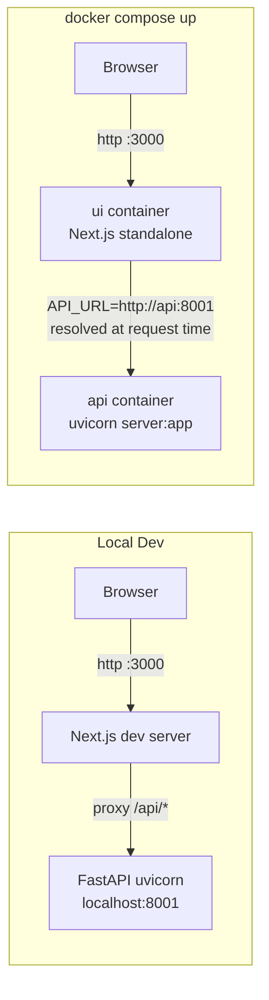
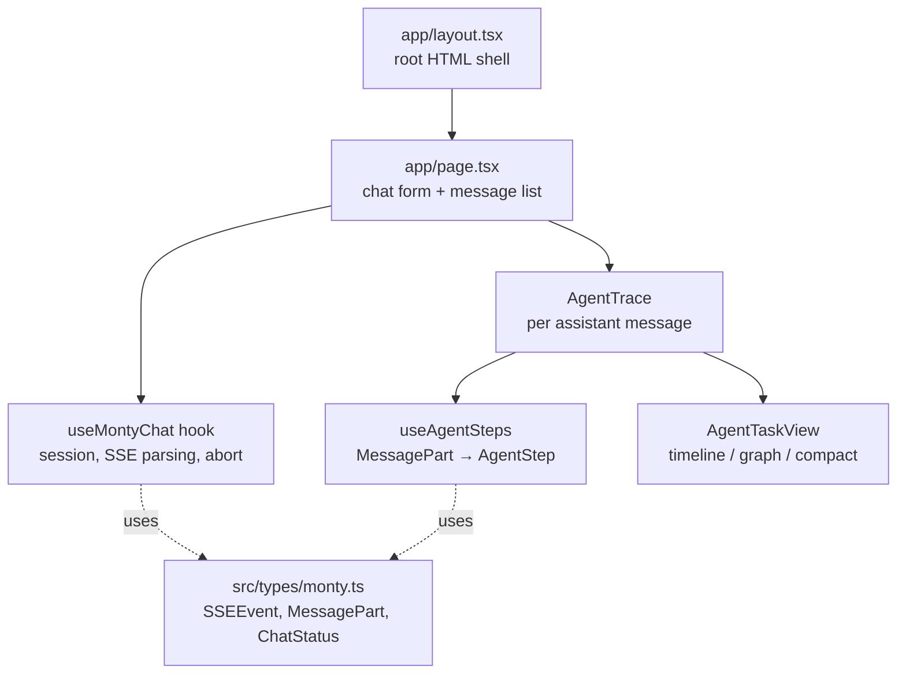
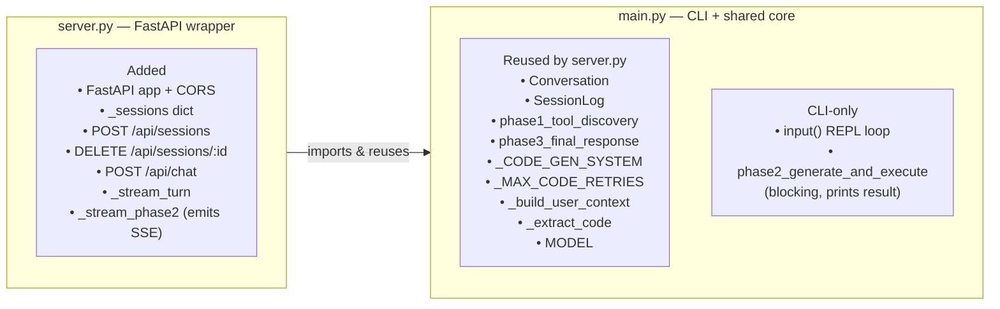
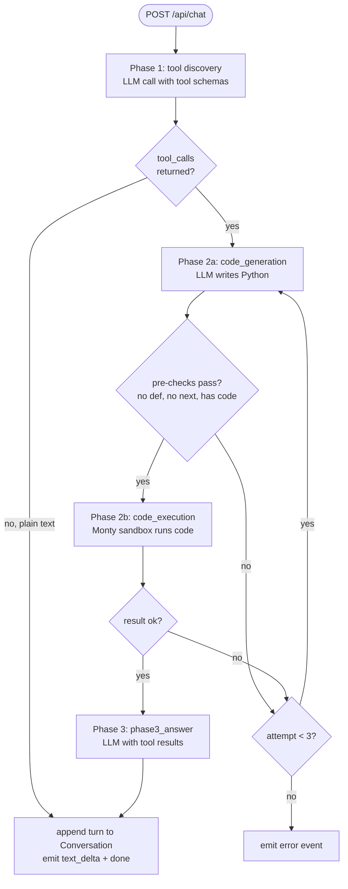
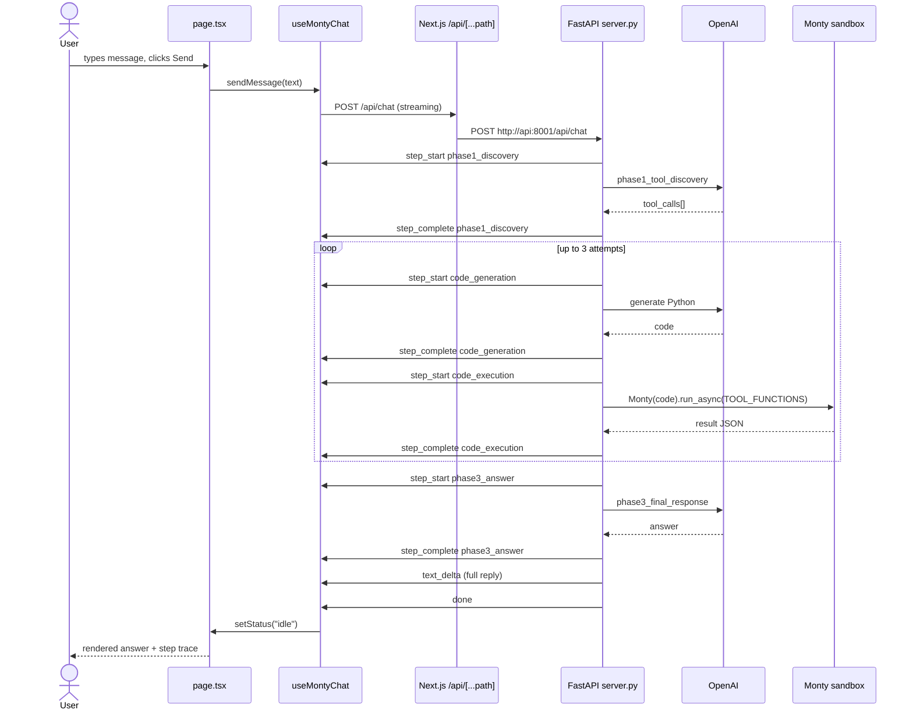
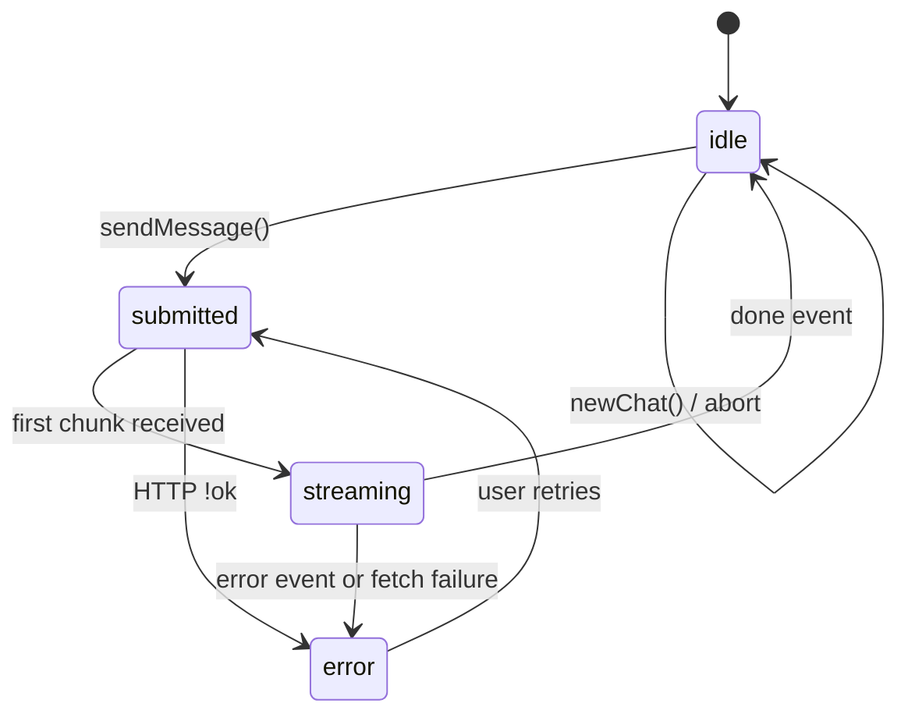

# Architecture

This document describes how the web UI in this repo works end-to-end. The system has two processes: a **Next.js 15** frontend on port `3000` and a **FastAPI** backend on port `8001`. The frontend proxies all `/api/*` calls to the backend through a Next.js catch-all route resolved at request time (so it works in both local dev and Docker). The backend runs a three-phase pipeline — tool discovery → Monty-sandboxed code execution → final answer — and streams every step back to the browser as Server-Sent Events.

## 1. Deployment Topology



The proxy is implemented in `ui/app/api/[...path]/route.ts`. `API_URL` is read **per-request** via a function (`() => process.env.API_URL ?? "http://localhost:8001"`) rather than at build time — this was the fix in commit `75b05ca` that made Docker env vars actually take effect.

## 2. Frontend Component Tree



State is kept local in React — no Redux/Zustand. `useMontyChat` owns the three pieces of state that matter: `sessionId`, `messages[]`, and `status`. Each assistant message's `parts[]` array is mutated in place as SSE events stream in, and React re-renders `AgentTrace` on every update so the user sees progress as it happens.

## 3. Backend Structure: CLI and API Share a Core

`server.py` is a streaming wrapper around `main.py` — the CLI entry point. Most of the pipeline logic lives in `main.py` and is imported unchanged; `server.py` adds a FastAPI app, a per-session store, and one reimplemented phase so progress can be streamed as Server-Sent Events.



**Runtime differences at a glance:**

| Aspect | CLI (`python main.py`) | Container (`uvicorn server:app`) |
|--------|------------------------|----------------------------------|
| Process model | One process, one conversation | One process, N conversations |
| Session scope | Lifetime of the process | Keyed by UUID in `_sessions` dict |
| Phase 2 output | Blocks, then prints result | Yields `step_start` / `step_complete` SSE between each retry attempt |
| Entry loop | `while True: input()` | One `POST /api/chat` = one turn |

**Session store.** `_sessions: dict[str, tuple[Conversation, SessionLog, AsyncOpenAI]]` (`server.py:45`). `POST /api/sessions` allocates the tuple under a new UUID; `DELETE /api/sessions/{id}` pops it and calls `log.close(conversation.history)` to flush the session log. The dict is process-local — restarting the `api` container or running multiple replicas loses state. That is acceptable for the current single-container deploy; a multi-replica setup would need Redis or a DB.

## 4. Backend Three-Phase Pipeline



All four step names (`phase1_discovery`, `code_generation`, `code_execution`, `phase3_answer`) are emitted as matched `step_start`/`step_complete` SSE pairs with stable `callId`s (`p1_{uid}`, `p2gen_{uid}_{attempt}`, `p2exec_{uid}_{attempt}`, `p3_{uid}`) so the frontend can correlate updates. If Phase 1 returns plain text (no tools needed), Phases 2 and 3 are skipped entirely and that text is the reply.

## 5. End-to-End Request Sequence



Transport is plain HTTP/1.1 with `Content-Type: text/event-stream` and `X-Accel-Buffering: no` to keep proxies from buffering. No WebSocket is involved. The Next.js proxy forwards the streaming body with `duplex: "half"` so chunks arrive in real time.

## 6. SSE Event & MessagePart Data Model

```mermaid
classDiagram
  class SSEEvent {
    <<union>>
  }
  class SSEStepStart {
    +"step_start" type
    +string name
    +string callId
    +Record input
  }
  class SSEStepComplete {
    +"step_complete" type
    +string name
    +string callId
    +unknown output
  }
  class SSETextDelta {
    +"text_delta" type
    +string text
  }
  class SSEDone {
    +"done" type
  }
  class SSEError {
    +"error" type
    +string message
  }
  SSEEvent <|-- SSEStepStart
  SSEEvent <|-- SSEStepComplete
  SSEEvent <|-- SSETextDelta
  SSEEvent <|-- SSEDone
  SSEEvent <|-- SSEError

  class MessagePart {
    <<union>>
  }
  class TextPart {
    +"text" type
    +string text
  }
  class ToolPart {
    +string type  "tool-{stepName}"
    +string toolCallId
    +Record input
    +state: input-available | output-available | output-error
    +unknown output
  }
  MessagePart <|-- TextPart
  MessagePart <|-- ToolPart

  class ChatMessage {
    +string id
    +role: user | assistant
    +MessagePart[] parts
  }
  ChatMessage "1" o-- "many" MessagePart
```

`useMontyChat` maps SSE events to parts like this: `step_start` pushes a new `ToolPart` with `state="input-available"`; `step_complete` flips that same part (located by `callId`) to `output-available` or `output-error` depending on whether `output.status === "error"`; `text_delta` appends to the trailing `TextPart` or creates a new one.

## 7. Chat Status Lifecycle



`submitted` covers the window between the POST going out and the first SSE chunk arriving. `streaming` is when chunks are actively flowing. `newChat()` aborts any in-flight request, DELETEs the old session, POSTs a new one, and clears `messages[]`.

## 8. Key Files

| Area | File |
|------|------|
| Chat UI entry | `ui/app/page.tsx` |
| Chat state + SSE stream | `ui/src/hooks/useMontyChat.ts` |
| Agent step rendering | `ui/src/agenttrace/AgentTrace.tsx`, `AgentTaskView.tsx`, `useAgentSteps.ts` |
| SSE / MessagePart types | `ui/src/types/monty.ts` |
| Runtime API proxy | `ui/app/api/[...path]/route.ts` |
| FastAPI wrapper: endpoints, `_sessions` store, `_stream_turn`, `_stream_phase2` (reimplements Phase 2 for SSE) | `server.py` |
| CLI entry + shared core reused by `server.py`: `Conversation`, `SessionLog`, `phase1_tool_discovery`, `phase3_final_response`, prompts, `_extract_code`, `_build_user_context` | `main.py` |
| Tool stubs + real implementations | `external_tools.py` |
| Container orchestration | `docker-compose.yml`, `ui/Dockerfile`, `api/Dockerfile` |
| Next.js standalone config | `ui/next.config.ts` |
